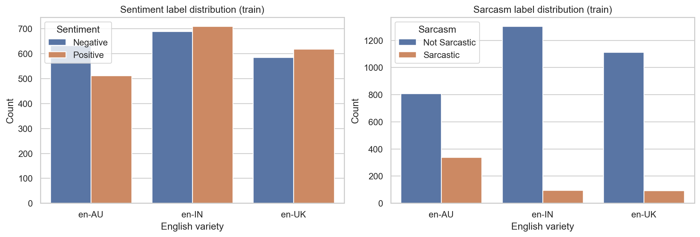
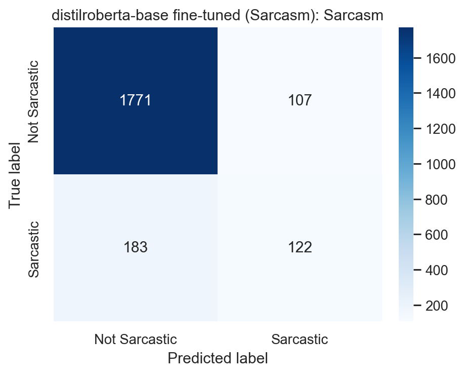

# BESSTIE-NLP-Classifier 🚀

A multi-variety English sentiment and sarcasm classifier built on the **BESSTIE** (A BEnchmark for Sentiment and Sarcasm classification for varieTIes of English) benchmark. 

This project addresses linguistic bias in sentiment analysis by evaluating and classifying text across three varieties of English: **Australian**, **British**, and **Indian**.

## ✨ Features
- **Multi-Variety Support**: Fine-tuned classification for diverse English dialects.
- **RoBERTa-based Classification**: Leverages state-of-the-art transformer models for high accuracy.
- **Classical Baselines**: Includes Logistic Regression baselines for performance comparison.
- **Interactive UI**: Built with Gradio for real-time sentiment and sarcasm prediction.

## 🛠️ Tech Stack
- **Languages**: Python
- **Frameworks**: Transformers (Hugging Face), PyTorch, Gradio
- **Models**: RoBERTa, Logistic Regression
- **Dataset**: BESSTIE (from [Hugging Face](https://huggingface.co/datasets/unswnlporg/BESSTIE))

## 🚀 Getting Started

### Prerequisites
- Python 3.8+
- PyTorch (with CUDA support for faster training)

### Installation
1. Clone the repository:
   ```bash
   git clone https://github.com/DeepSoul-173/BESSTIE-NLP-Classifier.git
   ```
2. Install dependencies:
   ```bash
   pip install -r requirements.txt
   ```

### Running the App
To launch the Gradio interface:
```bash
python app.py
```

## 📊 Results

### Performance Metrics
Below are the macro-averaged results for the baseline classical models:

| Model | Task | Macro F1 | Precision | Recall |
|---|---|---|---|---|
| **TF-IDF + Linear SVM** | Sentiment | **0.8407** | 0.8418 | 0.8404 |
| **TF-IDF + Logistic Regression** | Sentiment | 0.8287 | 0.8300 | 0.8285 |
| **TF-IDF + Logistic Regression** | Sarcasm | **0.6275** | 0.6143 | 0.6688 |
| **TF-IDF + Linear SVM** | Sarcasm | 0.5932 | 0.6103 | 0.5838 |

### Cross-Variety Sarcasm Transfer (Encoder Model)
Evaluation of models trained on one variety and tested on others (Macro F1):

| Train \ Test | en-AU | en-IN | en-UK |
|---|---|---|---|
| **en-AU** | **0.7594** | 0.5087 | 0.6044 |
| **en-IN** | 0.4139 | **0.4822** | 0.4803 |
| **en-UK** | 0.4139 | 0.4822 | **0.4803** |

### Data Distribution


### Sarcasm Detection Visualized


## 📊 Dataset Summary
| Split | Variety | Rows | Reddit | Google | Sentiment (+) Rate | Sarcasm Rate |
|---|---|---|---|---|---|---|
| **Train** | en-UK | 1203 | 434 | 769 | 51.37% | 7.65% |
| **Train** | en-AU | 1145 | 756 | 389 | 44.72% | 29.43% |
| **Train** | en-IN | 1399 | 683 | 716 | 50.75% | 6.79% |
| **Test** | en-UK | 700 | 248 | 452 | 51.43% | 7.57% |
| **Test** | en-AU | 667 | 423 | 244 | 47.98% | 29.39% |
| **Test** | en-IN | 816 | 411 | 405 | 47.30% | 6.86% |

## 📊 Dataset Reference
This project utilizes the BESSTIE dataset, published in the *Findings of the Association for Computational Linguistics: ACL 2025*.

---
Developed by [DeepSoul-173](https://github.com/DeepSoul-173)
